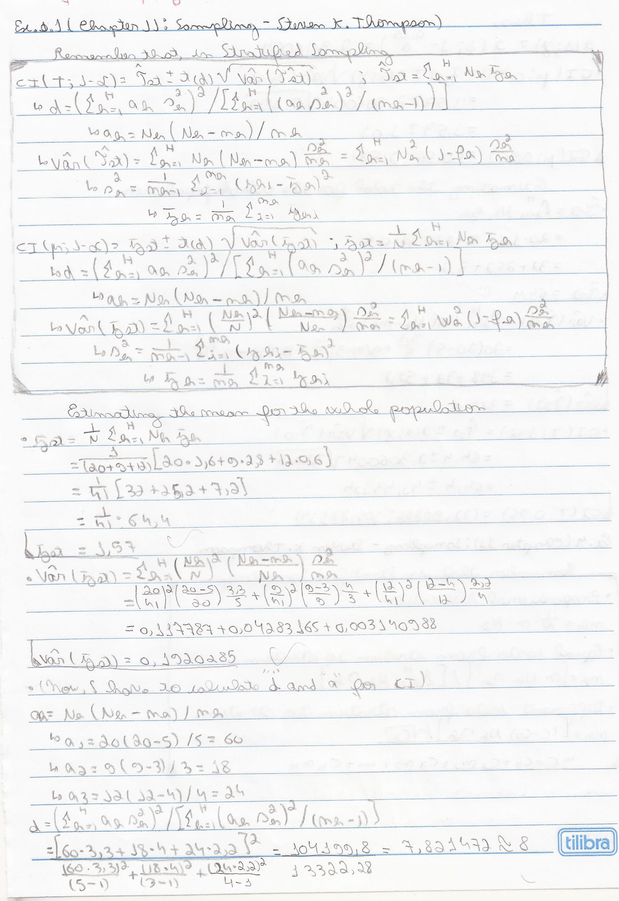

Stratified Sampling: Example 01
================
2022-07-12

``` r
source(file = "Functions.R")
```

## 01. \[Mean/Total\] Sampling (Steven K. Thompson), Chapter 11 Example 1


### Doing the calculations




### With my function

``` r
N_h=c(20,9,12)
n_h=c(5,3,4)
average_h=c(1.6,2.8,0.6)
s2_h=c(3.3,4,2.2)
alpha=0.05
N=sum(N_h)
stratified_random_sample_mean_total(N,N_h,n_h,average_h,s2_h,alpha)
```

    ##         . Pontual Variância        a        d trunc_d        t    erro
    ## 1 Average  1.5707     0.192 60;18;24 7.821472       7 2.364624  1.0362
    ## 2   Total 64.4000   322.800 60;18;24 7.821472       7 2.364624 42.4843
    ##                   IC
    ## 1    (0.5345;2.6069)
    ## 2 (21.9157;106.8843)

## 02. \[Allocation\] Sampling (Steven K. Thompson), Chapter 11 Example 4


### Doing the calculations


### With my function

``` r
N_h=c(150,90,120)
n=12
s2_h=c(100^2,200^2,300^2)
N=sum(N_h)
stratified_random_sample_allocation(N,N_h,n_h,average_h,s2_h)
```

    ## [1] "Proportional Allocation:"
    ## [1] 5 3 4
    ## [1] "This does not take into consideration the variability within each stratum and is not the optimal choice."
    ## [1] "##########################################"
    ## [1] "Optimal allocation where the cost of sampling from each stratum is the same:"
    ## [1] 3 3 6
    ## [1] "##########################################"
    ## [1] "-Note for Optimal allocation:"
    ## [1] "1. allocate a larger sample size to the larger and more variable stratum."
    ## [1] "2. allocates smaller sample sizes to the more expensive stratum."

## 03. \[Poststratification\] PennState (Eberly College os Science), Chapter 6.3 Example 6-2

<https://online.stat.psu.edu/stat506/lesson/6/6.3>


### Doing the calculations


### With my function

``` r
n_h=c(70,30)
average_h=c(520,280)
s2_h=c(210^2,90^2)
alpha=0.05
N=NA
real_prop=c(.4,.6)
n=100
fti=T #ignore the finite correction factor = FALSE
Pos_stratification_mean_total(N,n,n_h,average_h,s2_h,real_prop,alpha,fti)
```

    ## [1] "Ignoring the finite correction factor"
    ## [1] "Average:  376 | Var(Average):  227.97"

## 04. \[Mean/Total\] PennState (Eberly College os Science), Chapter 6.1 Example 6-1

<https://online.stat.psu.edu/stat506/lesson/6/6.1>


### Doing the calculations


### With my function

``` r
TVhour<-data.frame(
  Hour=c(35,43,36,39,28,28,29,25,38,27,26,32,29,40,35,41,37,31,45,34,27,15,4,41,49,25,10,30,8,14,12,15,30,32,21,20,34,7,11,24)
  ,Area=c(1,1,1,1,1,1,1,1,1,1,1,1,1,1,1,1,1,1,1,1,2,2,2,2,2,2,2,2,3,3,3,3,3,3,3,3,3,3,3,3)
)
#Foi dado que
stratum=TVhour$Area
y=TVhour$Hour
N_h=c(155,62,93)
#Obtendo os outros dados
n_h=tapply(y,stratum,length)
average_h=tapply(y,stratum,mean)
s2_h=tapply(y,stratum,var)
alpha=0.05
N=sum(N_h)
#Resultado
stratified_random_sample_mean_total(N,N_h,n_h,average_h,s2_h,alpha)
```

    ##         .  Pontual   Variância                    a        d trunc_d        t
    ## 1 Average   27.675      1.9695 1046.25;418.5;627.75 21.08961      21 2.079614
    ## 2   Total 8579.250 189270.8086 1046.25;418.5;627.75 21.08961      21 2.079614
    ##       erro                    IC
    ## 1   2.9185     (24.7565;30.5935)
    ## 2 904.7415 (7674.5085;9483.9915)

\##Using weighted.mean

``` r
#Tentando fazer usando weighted.mean o resultado não bate. PQ???
TVhour$peso=NA
TVhour$peso[which(TVhour$Area==1)]<-(N_h[1]/N)/n_h[1]
TVhour$peso[which(TVhour$Area==2)]<-(N_h[2]/N)/n_h[2]
TVhour$peso[which(TVhour$Area==3)]<-(N_h[3]/N)/n_h[3]
weighted.mean(TVhour$Hour,TVhour$peso)
```

    ## [1] 27.675

``` r
weighted.mean(x=TVhour$Hour,w=TVhour$peso)
```

    ## [1] 27.675

``` r
#Usando a fórmula do peso, bate
sum(tapply(TVhour$Hour, TVhour$Area, mean)*c((N_h[1]/N),(N_h[2]/N),(N_h[3]/N)))
```

    ## [1] 27.675

## 05. \[Allocation\] PennState (Eberly College os Science), Chapter 6.2 Example

<https://online.stat.psu.edu/stat506/lesson/6/6.2>


### Doing the calculations


### With my function

``` r
N_h=c(155,62,93)
n=40
s2_h=c(5^2,15^2,10^2)
N=sum(N_h)
stratified_random_sample_allocation(N,N_h,n_h,average_h,s2_h)
```

    ## [1] "Proportional Allocation:"
    ## [1] 20  8 12
    ## [1] "This does not take into consideration the variability within each stratum and is not the optimal choice."
    ## [1] "##########################################"
    ## [1] "Optimal allocation where the cost of sampling from each stratum is the same:"
    ## [1] 12 14 14
    ## [1] "##########################################"
    ## [1] "-Note for Optimal allocation:"
    ## [1] "1. allocate a larger sample size to the larger and more variable stratum."
    ## [1] "2. allocates smaller sample sizes to the more expensive stratum."

## 06. \[Poststratification\] PennState (Eberly College os Science), Chapter 6.3 Example 6-3

<https://online.stat.psu.edu/stat506/lesson/6/6.3>


### Doing the calculations


### With my function

``` r
N=NA
n=100
n_h=c(20,80)
average_h=c(180,120)
s2_h=NA
real_prop=c(.5,.5)
alpha=.05
ft=F
Pos_stratification_mean_total(N,n,n_h,average_h,s2_h,real_prop,alpha,fti)
```

    ## [1] "Ignoring the finite correction factor"
    ## [1] "Average:  150 | Var(Average):  I need s2_h"

## 06. \[Poststratification\] PennState (Eberly College os Science), Chapter 6.3 Example 6-2

<https://online.stat.psu.edu/stat506/lesson/6/6.3>


### Doing the calculations


### With my function

``` r
N=NA
n=100
n_h=c(70,30)
average_h=c(520,280)
s2_h=c(210^2,90^2)
real_prop=c(.4,.6)
alpha=.05
ft=T
Pos_stratification_mean_total(N,n,n_h,average_h,s2_h,real_prop,alpha,fti)
```

    ## [1] "Ignoring the finite correction factor"
    ## [1] "Average:  376 | Var(Average):  227.97"

## 07. \[Proportion\] PennState (Eberly College os Science), Chapter 6.3 Example 6-3

<https://online.stat.psu.edu/stat506/lesson/6/6.3>


### Doing the calculations


### With my function

``` r
N_h=c(155,62,93)
N=sum(N_h)
n_h=c(20,8,12)
proportion_h=c(16,2,6)/n_h
stratified_random_sample_proportion(N,N_h,n_h,proportion_h)
```

    ##            . Pontual            var_p_hat var_proportion
    ## 1 proportion     0.6 0.0073;0.0233;0.0198    0.004548321

## 08. \[Proportion\] PennState (Eberly College os Science), Chapter 6.3 Example 6-3

<https://online.stat.psu.edu/stat506/lesson/6/6.3>


### Doing the calculations

### With my function

``` r
Students_Weights<-data.frame(
  Weights=c(94,90,102,110,91,99,93,105,111,101,108,96,100,93,93,92,110,94,91,113)
  ,Class=c(rep(1,4),rep(2,6),rep(3,5),rep(4,5))
)
#Foi dado que
stratum=Students_Weights$Class
y=Students_Weights$Weights
N_h=c(24,36,30,30)
#Obtendo os outros dados
n_h=tapply(y,stratum,length)
average_h=tapply(y,stratum,mean)
s2_h=tapply(y,stratum,var)
alpha=0.05
N=sum(N_h)
#Resultado
stratified_random_sample_mean_total(N,N_h,n_h,average_h,s2_h,alpha)
```

    ##         . Pontual  Variância               a        d trunc_d        t     erro
    ## 1 Average    99.3     2.9339 120;180;150;150 13.76125      13 2.160369   3.7004
    ## 2   Total 11916.0 42248.0000 120;180;150;150 13.76125      13 2.160369 444.0490
    ##                      IC
    ## 1    (95.5996;103.0004)
    ## 2 (11471.951;12360.049)

## Using weighted.mean

``` r
#Tentando fazer usando weighted.mean o resultado não bate. PQ???
Students_Weights$peso=NA
Students_Weights$peso[which(Students_Weights$Class==1)]<-(N_h[1]/N)/n_h[1]
Students_Weights$peso[which(Students_Weights$Class==2)]<-(N_h[2]/N)/n_h[2]
Students_Weights$peso[which(Students_Weights$Class==3)]<-(N_h[3]/N)/n_h[3]
Students_Weights$peso[which(Students_Weights$Class==4)]<-(N_h[4]/N)/n_h[4]

weighted.mean(Students_Weights$Weights,Students_Weights$peso)
```

    ## [1] 99.3

``` r
weighted.mean(x=Students_Weights$Weights,w=Students_Weights$peso)
```

    ## [1] 99.3

``` r
#Usando a fórmula do peso, bate
sum(tapply(Students_Weights$Weights, Students_Weights$Class, mean)*c(N_h[1]/N,N_h[2]/N,N_h[3]/N,N_h[4]/N) )
```

    ## [1] 99.3
