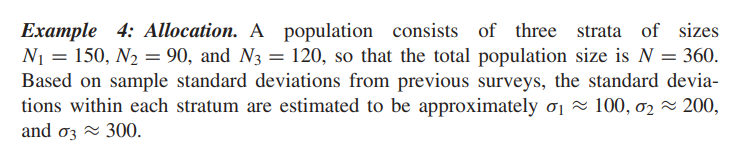
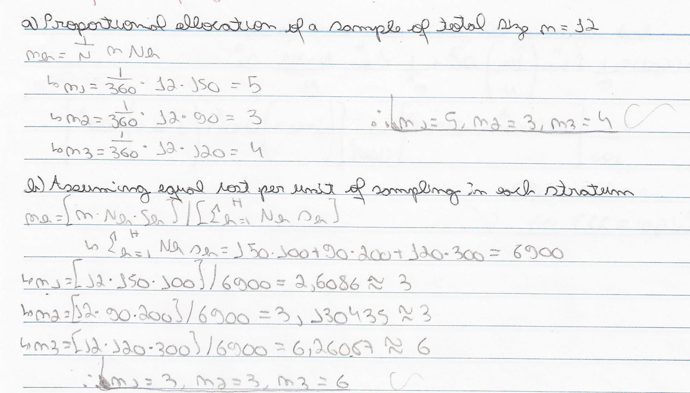
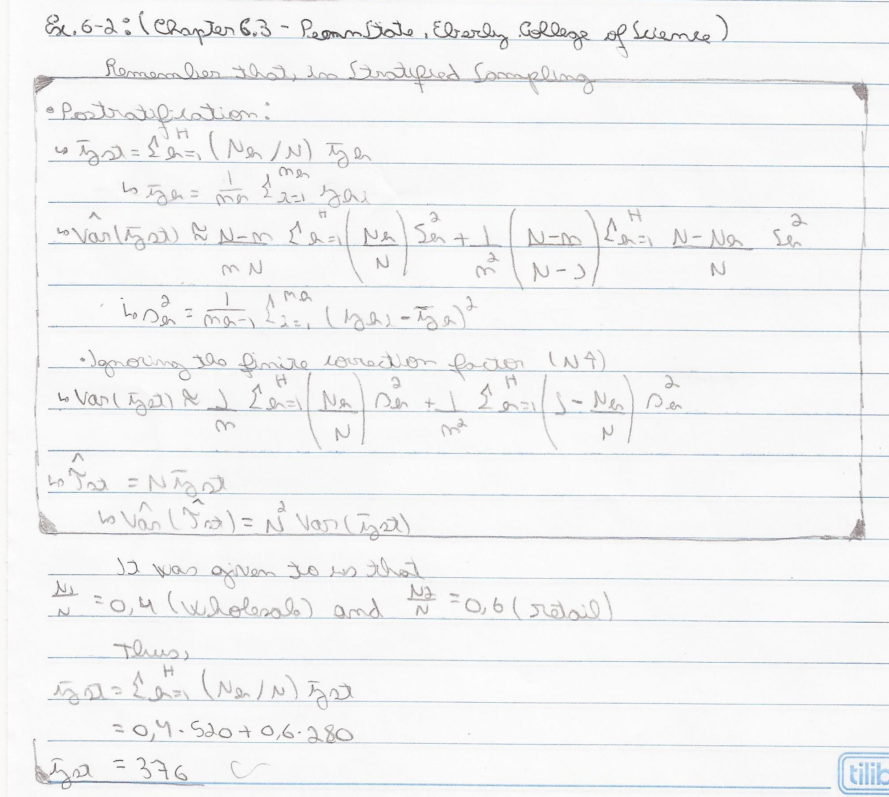

```{r}
source(file = "Functions.R")
```
# 01. Sampling (Steven K. Thompson), Chapter 11 Example 1

```{r pressure, echo=F, out.width = '100%'}
knitr::include_graphics("Images/01.png")
```

## Doing the calculations

```{r, echo=F, out.width = '50%'}
knitr::include_graphics("Images/01-1.jpg")
```
```{r, echo=F, out.width = '50%'}
knitr::include_graphics("Images/01-2.jpg")
```

## With my function
```{r}
N_h=c(20,9,12)
n_h=c(5,3,4)
average_h=c(1.6,2.8,0.6)
s2_h=c(3.3,4,2.2)
alpha=0.05
N=sum(N_h)
stratified_random_sample_mean_total(N,N_h,n_h,average_h,s2_h,alpha)
```

# 02. Sampling (Steven K. Thompson), Chapter 11 Example 4

```{r, echo=F, out.width = '100%'}

```

## Doing the calculations

```{r, echo=F, out.width = '50%'}
knitr::include_graphics("Images/02-1.jpg")
```
```{r, echo=F, out.width = '50%'}

```

## With my function
```{r}
N_h=c(150,90,120)
n=12
s2_h=c(100^2,200^2,300^2)
N=sum(N_h)
stratified_random_sample_allocation(N,N_h,n_h,average_h,s2_h)
```
# 03. PennState (Eberly College os Science), Chapter 6.3 Example 6-2 

https://online.stat.psu.edu/stat506/lesson/6/6.3

```{r, echo=F, out.width = '100%'}
knitr::include_graphics("Images/03.png")
```

## Doing the calculations

```{r, echo=F, out.width = '50%'}

```
```{r, echo=F, out.width = '50%'}
knitr::include_graphics("Images/03-2.jpg")
```

## With my function
```{r}
n_h=c(70,30)
average_h=c(520,280)
s2_h=c(210^2,90^2)
alpha=0.05
N=NA
real_prop=c(.4,.6)
n=100
fti=T #ignore the finite correction factor = FALSE
Pos_stratification_mean_total(N,n,n_h,average_h,s2_h,real_prop,alpha,fti)
```
