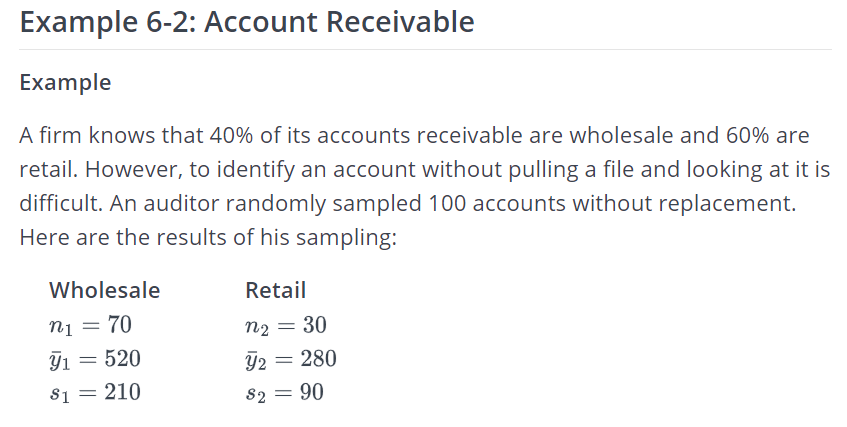
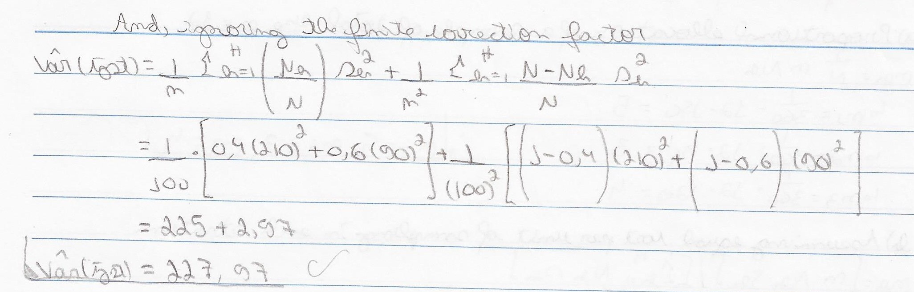

Stratified Sampling: Example 01
================
2022-07-12

``` r
source(file = "Functions.R")
```

# 01. Sampling (Steven K. Thompson), Chapter 11 Example 1


## Doing the calculations


## With my function

``` r
N_h=c(20,9,12)
n_h=c(5,3,4)
average_h=c(1.6,2.8,0.6)
s2_h=c(3.3,4,2.2)
alpha=0.05
N=sum(N_h)
stratified_random_sample_mean_total(N,N_h,n_h,average_h,s2_h,alpha)
```

    ##         . Pontual Variância        a        d        t    erro
    ## 1 Average  1.5707     0.192 60;18;24 7.821472 2.306004  1.0105
    ## 2   Total 64.4000   322.800 60;18;24 7.821472 2.306004 41.4311
    ##                   IC
    ## 1    (0.5602;2.5812)
    ## 2 (22.9689;105.8311)

# 02. Sampling (Steven K. Thompson), Chapter 11 Example 4


## Doing the calculations


## With my function

``` r
N_h=c(150,90,120)
n=12
s2_h=c(100^2,200^2,300^2)
N=sum(N_h)
stratified_random_sample_allocation(N,N_h,n_h,average_h,s2_h)
```

    ## [1] "Proportional Allocation:"
    ## [1] 5 3 4
    ## [1] "This does not take into consideration the variability within each stratum and is not the optimal choice."
    ## [1] "##########################################"
    ## [1] "Optimal allocation where the cost of sampling from each stratum is the same:"
    ## [1] 3 3 6
    ## [1] "##########################################"
    ## [1] "-Note for Optimal allocation:"
    ## [1] "1. allocate a larger sample size to the larger and more variable stratum."
    ## [1] "2. allocates smaller sample sizes to the more expensive stratum."

# 03. PennState (Eberly College os Science), Chapter 6.3 Example 6-2

<https://online.stat.psu.edu/stat506/lesson/6/6.3>



## Doing the calculations




## With my function

``` r
n_h=c(70,30)
average_h=c(520,280)
s2_h=c(210^2,90^2)
alpha=0.05
N=NA
real_prop=c(.4,.6)
n=100
fti=T #ignore the finite correction factor = FALSE
Pos_stratification_mean_total(N,n,n_h,average_h,s2_h,real_prop,alpha,fti)
```

    ## [1] "Ignoring the finite correction factor"
    ## [1] "Average:  376 | Var(Average):  227.97"
