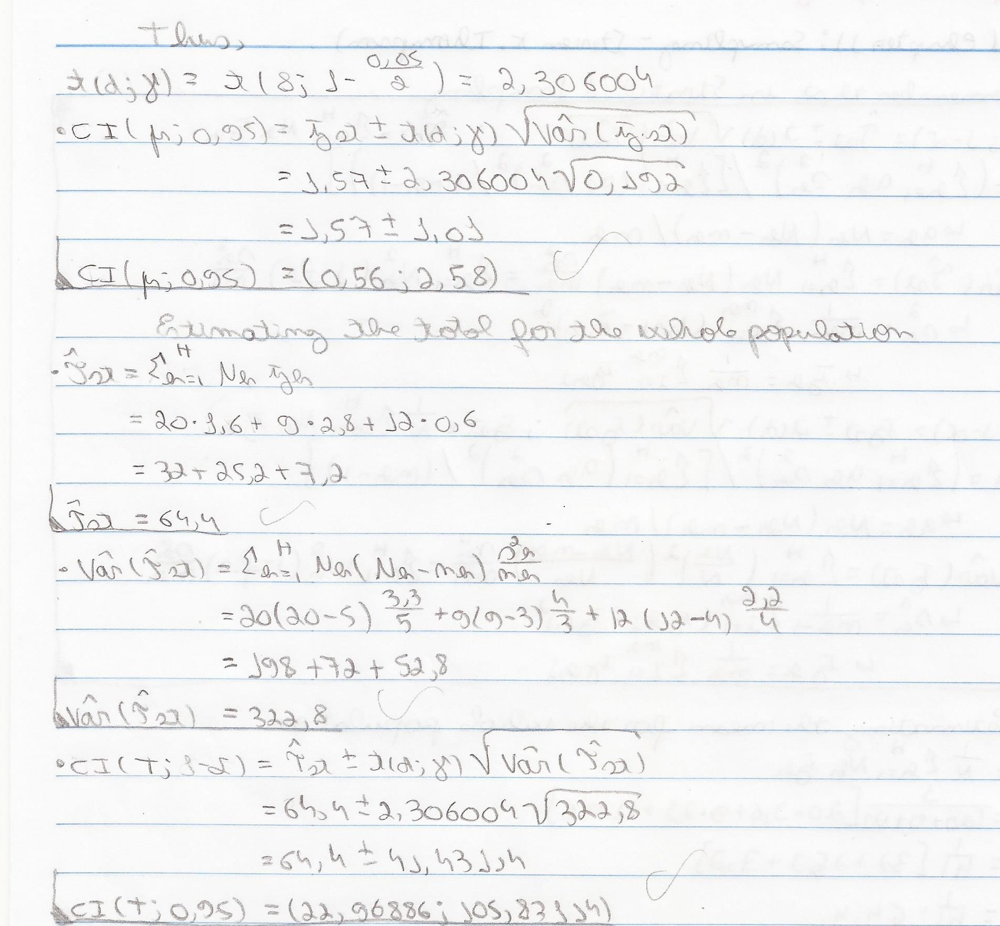

```{r}
source(file = "Functions.R")
```

# 01
```{r pressure, echo=F, out.width = '100%'}
knitr::include_graphics("Images/01.png")
```

## Doing the calculations

```{r, echo=F, out.width = '50%'}
knitr::include_graphics("Images/01-1.jpg")
```
```{r, echo=F, out.width = '50%'}

```

## With my function
```{r}
N_h=c(20,9,12)
n_h=c(5,3,4)
average_h=c(1.6,2.8,0.6)
s2_h=c(3.3,4,2.2)
alpha=0.05
N=sum(N_h)
stratified_random_sample_mean_total(N,N_h,n_h,average_h,s2_h,alpha)
```

