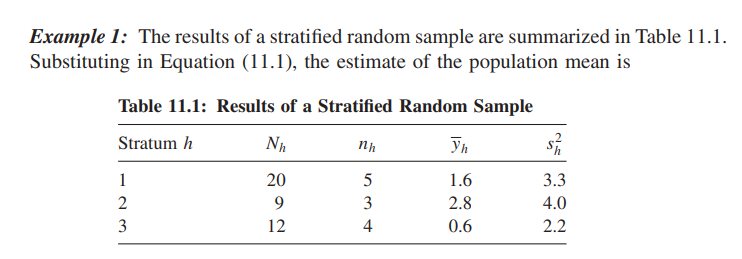
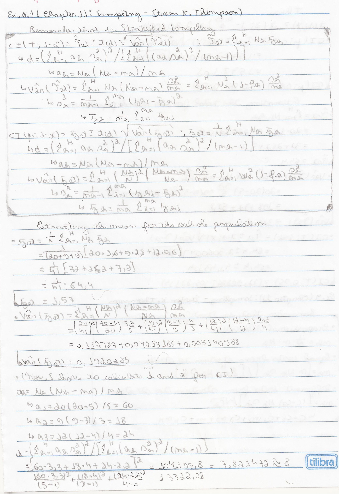
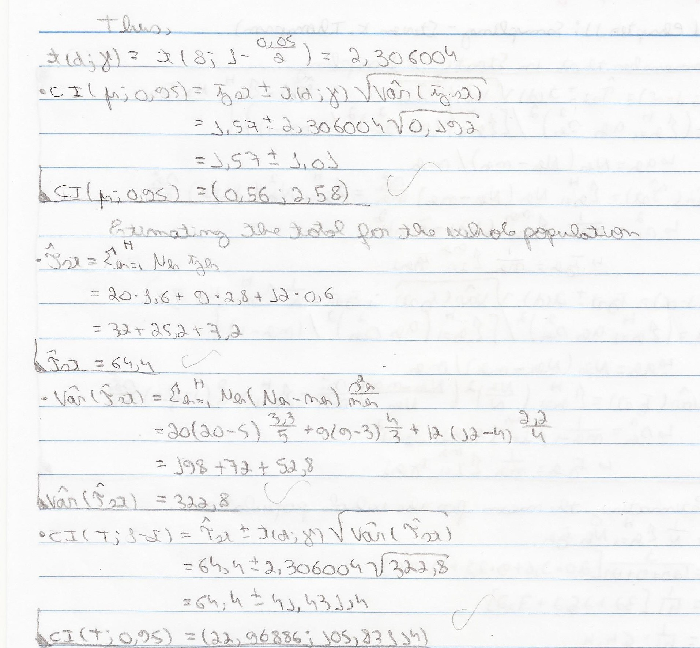

Stratified Sampling
================
2022-07-12

``` r
source(file = "Functions.R")
```

# 01



## Doing the calculations




## With my function

``` r
N_h=c(20,9,12)
n_h=c(5,3,4)
average_h=c(1.6,2.8,0.6)
s2_h=c(3.3,4,2.2)
alpha=0.05
N=sum(N_h)
stratified_random_sample_mean_total(N,N_h,n_h,average_h,s2_h,alpha)
```

    ##         . Pontual Variância        a        d        t    erro
    ## 1 Average  1.5707     0.192 60;18;24 7.821472 2.306004  1.0105
    ## 2   Total 64.4000   322.800 60;18;24 7.821472 2.306004 41.4311
    ##                   IC
    ## 1    (0.5602;2.5812)
    ## 2 (22.9689;105.8311)
